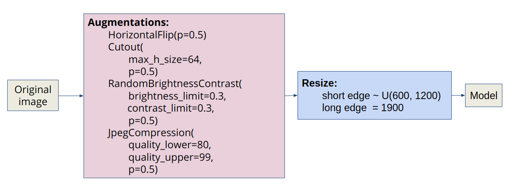
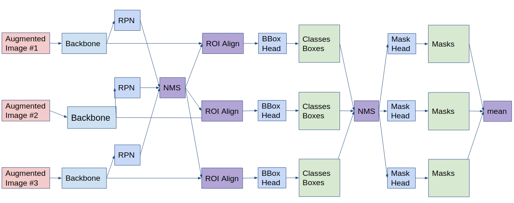
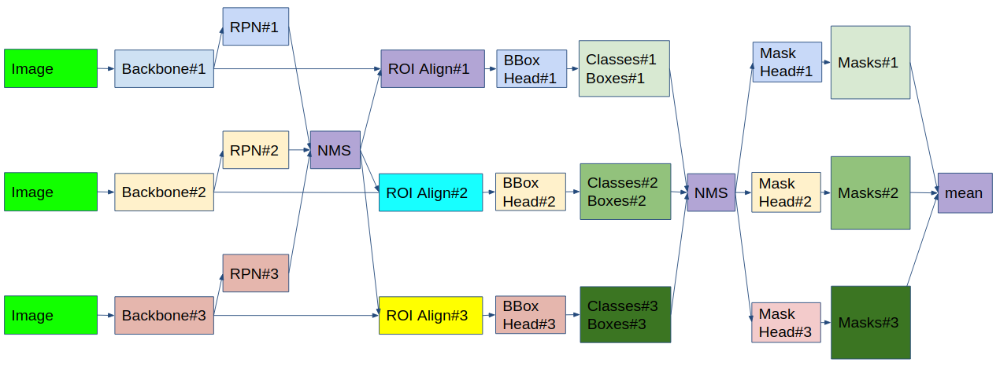

# The First Place Solution of [iMaterialist (Fashion) 2019](https://www.kaggle.com/c/imaterialist-fashion-2019-FGVC6/)

https://github.com/amirassov/kaggle-imaterialist


## Solution
My solution is based on the COCO challenge 2018 winners article: https://arxiv.org/abs/1901.07518. 

### Model: 
[Hybrid Task Cascade with ResNeXt-101-64x4d-FPN backbone](https://github.com/open-mmlab/mmdetection/blob/master/configs/htc/htc_dconv_c3-c5_mstrain_400_1400_x101_64x4d_fpn_20e.py). This model has a metric Mask mAP = 43.9 on COCO dataset. This is SOTA for instance segmentation.

### Validation:
For validation, I used 450 training samples splitted using https://github.com/trent-b/iterative-stratification.

### Preprocessing:
I applied light augmentatios from the [albumentations](https://github.com/albu/albumentations) library to the original image. Then I use multi-scale training: in each iteration, the scale of short edge is randomly sampled
from [600, 1200], and the scale of long edge is fixed as 1900.



### Training details:
* pre-train from COCO
* optimizer: `SGD(lr=0.03, momentum=0.9, weight_decay=0.0001)`
* batch_size: 16 = 2 images per gpu x 8 gpus Tesla V100
* learning rate scheduler:
```
if iterations < 500:
   lr = warmup(warmup_ratio=1 / 3)
if epochs == 10:
   lr = lr ∗ 0.1
if epochs == 18:
   lr = lr ∗ 0.1
if epochs > 20:
   stop
```
* training time: ~3 days.

### Parameter tuning:
After the 12th epoch with the default parameters, the metric on LB was **0.21913**. Next, I tuned postprocessing thresholds using validation data:
```
rcnn=dict(
    score_thr=0.5,
    nms=dict(type='nms', iou_thr=0.3),
    max_per_img=100,
    mask_thr_binary=0.45
)
```

This improved the metric on LB: **0.21913 -&gt; 0.30011.**

### Test time augmentation:
I use 3 scales as well as horizontal flip at test time and ensemble the results. Testing scales are (1000, 1600), (1200, 1900), (1400, 2200). 

I drew a TTA scheme for Mask R-CNN, which is implemented in mmdetection library. For Hybrid Task Cascade R-CNN, I rewrote this code. 

This improved the metric on LB: **0.30011 -&gt; 0.31074.**



### Ensemble:
I ensemble the 3 best checkpoints of my model. The ensemble scheme is similar to TTA. 

This improved the metric on LB: **0.31074 -&gt; 0.31626.**



### Attributes:
I didn't use attributes at all: they were difficult to predict and the removal of classes with attributes greatly improved the metric. 

During the whole competition, I deleted classes with attributes: `{0, 1, 2, 3, 4, 5, 6, 7, 8, 9, 10, 11, 12}` U `{27, 28, 33}`. But two days before the end I read [the discussion] (https://www.kaggle.com/c/kaggle-imaterialist-fashion-2019-FGVC6/discussion/94811#latest548137) and added back classes `{27, 28, 33 }`. 

This improved the metric on LB: **0.31626 -&gt; 0.33511.**

### Postprocessing for masks
My post-processing algorithm for avoid intersections of masks of the same class:
```python
def hard_overlaps_suppression(binary_mask, scores):
    not_overlap_mask = []
    for i in np.argsort(scores)[::-1]:
        current_mask = binary_mask[..., i].copy()
        for mask in not_overlap_mask:
            current_mask = np.bitwise_and(current_mask, np.invert(mask))
        not_overlap_mask.append(current_mask)
    return np.stack(not_overlap_mask, -1)
```

### Small postprocessing:
I deleted objects with an area of less than 20 pixels. 

This improved the metric on LB: **0.33511 -&gt; 0.33621.**

## How to run?

### Docker
```bash
make build
make run-[server-name]
make exec
```

### Build mmdetection:
```bash
cd mmdetection
bash compile.sh
python setup.py develop
```

### Prepare pretrained weights:
```bash
bash prepare_weights.sh
```

### Data structure
```
/data/
├── train/
│   └── ...
├── test/
│   └── ...
└── train.csv.zip
/dumps/
└── htc_dconv_c3-c5_mstrain_x101_64x4d_fpn_20e_1200x1900/

```
Fix the [error](https://www.kaggle.com/c/kaggle-imaterialist-fashion-2019-FGVC6/discussion/91217#latest-529042) in `train.csv.zip.`

### Prepare annotations for mmdetection:
```bash
cd scripts
bash create_mmdetection_train.sh
bash create_mmdetection_test.sh
bash split.sh
```

### Training the model:
```bash
CUDA_VISIBLE_DEVICES=[list of gpus] bash dist_train.sh [config] [gpus] [--validate] 
```

### Test the model:
```bash
CUDA_VISIBLE_DEVICES=[list of gpus] bash dist_test_ensemble.sh [config] [gpus]
```


## References
* https://github.com/open-mmlab/mmdetection
